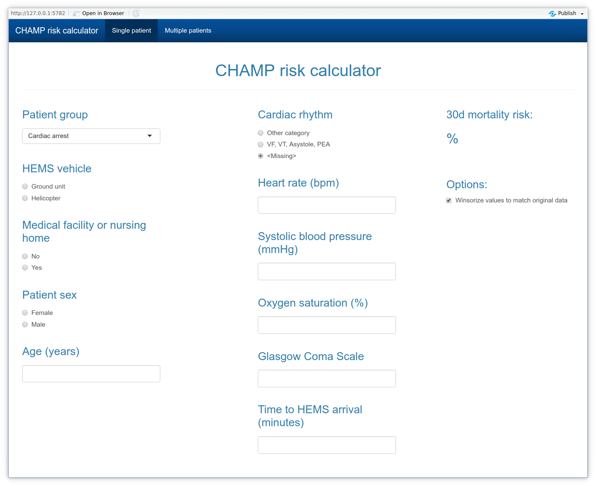
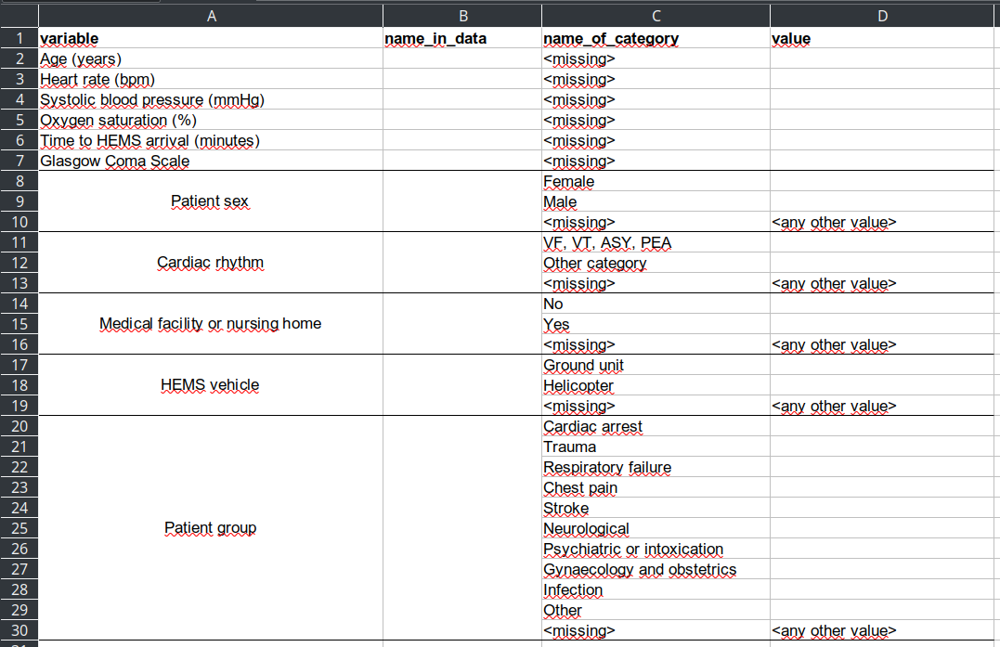

# What is CHAMP

CHAMP calculator is a tool which utilizes the algorithm introduced by 
Reitala et. al 2022. to estimate a 30 day mortality risk in patients 
encountered by physician-staffed helicopter emergency medical services.


# Launching the application

## Web-version

Web-version is available at [https://champcalculator.herokuapp.com/](https://champcalculator.herokuapp.com/)


## As R package

### Installing R

Firstly you need to install R [https://cran.r-project.org/](https://cran.r-project.org/)
It is also recommended to install RStudio IDE for using R: 
[https://www.rstudio.com/products/rstudio/download/](https://www.rstudio.com/products/rstudio/download/)

After installing these launch RStudio and follow the instructions below.

### Installing the package

To install the package install remotes package and use the install_github-function
to install the package directly from github:

```r
# To install
# install.packages("remotes")
remotes::install_github("laamit/champCalculator")
```

### Shiny GUI

The shiny GUI for application can be launched in R:

```r
# After installing the package, launch shiny app
champCalculator::run_app()
```

### Commands in R

Below is an example of using the function. The inputs can either be single 
values or vectors of the same length.

```r
library(champCalculator)

calculate_champ(rr = 100,
pulse = 100,
spo2 = 100,
gcs = 15,
time_to_hems = 100,
cardiac_rhythm = 1,
age = 20,
medical_facility = 0,
vehicle_ground_unit = 1,
sex_male = 1,
code = "trauma")
```


# Using the shiny app

In short, the tool can be used to either calculate the risk of 30 mortality for 
one patient using the *Single patient*-tab or for multiple patients using the 
*Multiple patients*-tab. The former can be directly given the values of the variables 
whereas the latter requires both the variable definitions excel table and the data
as an excel table or csv file.


## Single patient -tab



The *Single patient*-tab requires the user to manually input the values.

To calculate the predicted risk for 30 day mortality you simply need to fill in 
the values and the risk will be automatically calculated.
The application automatically chooses the best available model for the given 
variables i.e. if systolic blood pressure is missing just leave the input empty.


## Multiple patients -tab

### Usage


The *Tables*-tab uses the *variable_definitions.xlsx* to read the given data and
wrangle it for the tool. The risk can then be calculated and the given data can 
be downloaded with the additional risk-column included.

To calculate the risk using this tab you need to:

1. fill in the *variable_definitions.xlsx* so the variables can be matched to the calculator
2. launch the app and upload both definitions and data to it
3. Press *calculate the risk* -button
4. Get the data with the risk using the *Download data with risk* -button

By default the values of the variables will be limited to match the original data better, 
values below 0.5 percentile or above 99.5 percentile will be winsorized to those 
values. You can disable this by toggling the *Winsorize values to match original data* 
in the *Options* column.

Note: The winsorization can lead to different results between the multiple and single 
patient tabs due to the values changing.

The application will show potential warnings about bad or wrong input data under the
"Download data with risk" -button. In this case double check your variable_definitions-table 
for potential errors.   
If the continuous variables are beyond the given limits you can use the 
winsorization toggle to limit the values to more reliable scale and avoid 
potentially unrealiable results.


### Preparing the variable defitions excel table



The columns included in the table are:

* variable = Used to match the variable data to the variables used by the application, DO NOT CHANGE
* name_in_data = Name of the variable in the data to be uploaded to the application
* name_of_category = Category of the variable, DO NOT CHANGE
* value = values of the category of the variable

You only need to make changes to the *name_in_data* and *value* columns. The 
name_in_data needs to match the name of the column in the data exactly and names 
beginning with numbers or special characters should be avoided.
The *value* column values need to be exact and be separated by only a single 
comma (,). 

For numeric variables after converting the missing values to NA (= how R codes 
them as missing) and the rest will be forced to be numeric. So values like "14" 
will be 14 but values like "14a" will be handled as missing.

For categorical values all the non-defined categories will be handled as missing
e.g. if for sex Woman is defined as 0 and Man as 1 then all other values will be 
converted to missing values (= NA in R). This can lead to NA risk estimates if 
the variable with missing values is not one of the six allowed missing variables.


# Using the R functions

After installing the package you you can use the calculate_champ-function to
calculate the champ risk:

```r
library(champCalculator)

calculate_champ(rr = 100,
pulse = 100,
spo2 = 100,
gcs = 15,
time_to_hems = 100,
cardiac_rhythm = 1,
age = 20,
medical_facility = 0,
vehicle_ground_unit = 1,
sex_male = 1,
code = "trauma")
```

Note that the calculate_champ-function expects the continous variables to be 
numeric and binary variables to be 0/1 or FALSE/TRUE. 
The patient group (*code*-parameter) requires values of "cardiac arrest", 
"trauma", "respitory failure", "chest pain", "stroke", 
"neurological", "psychiatric or intoxication", or "other". All other non-missing 
values are assumed to not be in any of those groups and instead belong to 
"Gynaecology and obstetrics" and "Infection" groups.


To use the variable_definitions-excel use the wrangle_variable-function to
wrangle the data into the required format:

```r
library(champCalculator)

# load the unprocessed data
#unprocessed_data <- ....

# load the variable_definitons-excel
# install.packages("readxl") # if readxl is not installed run 
df_definitions <- readxl::read_excel("variable_definitions.xlsx")

# Note: wrangle_variable expects a single variable as input
# so use lapply to loop through the variable wrangling
data_wrangled <- lapply(champCalculator::var_names$data, 
  wrangle_variable,
  df_in = data_input(), 
  df_definitions = data_definitions()) %>%
  # set column names and combine to data frame
  purrr::set_names(champCalculator::var_names$func) %>%
  dplyr::bind_cols()

# add the champ risk to the original data
unprocessed_data$risk <-  with(data_wrangled, 
  champCalculator::calculate_champ(rr = rr,
                  pulse = pulse,
                  spo2 = spo2,
                  gcs = gcs,
                  time_to_hems = time_to_hems,
                  cardiac_rhythm = cardiac_rhythm,
                  age = age,
                  medical_facility = medical_facility,
                  vehicle_ground_unit = vehicle_ground_unit,
                  sex_male = sex_male,
                  code = code))  
```

