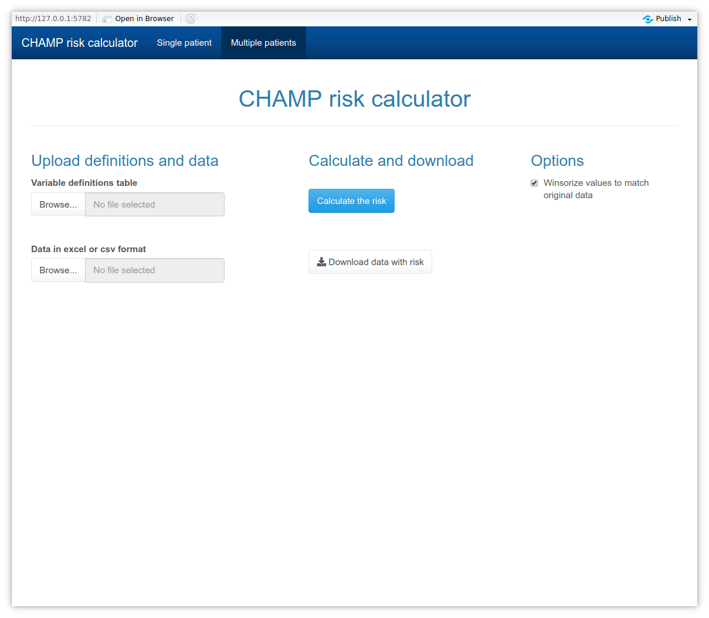

# What is CHAMP

CHAMP risk calculator is a tool which utilizes the algorithm introduced
by Reitala et. al 2022.

# Installation

## As R package

The application can be launched using R:

``` r
# To install
# install.packages("remotes")
remotes::install_github("laamit/champCalculator")

# To launch
champCalculator::run_app()
```

## As a standalone executable (WIP)

The application will be packaged using electron into a standalone
executable for Windows. These will be available for download in the
releases section.

# Usage

In short, the tool can be used to either calculate the risk of 30
mortality for one patient using the *Single patient*-tab or for multiple
patients using the *Multiple patients*-tab. The former can be directly
given the values of the variables whereas the latter requires both the
variable definitions excel table and the data as an excel table or csv
file.

## Multiple patients -tab

### Usage



The *Tables*-tab uses the *variable_definitions.xlsx* to read the given
data and wrangle it for the tool. The risk can then be calculated and
the given data can be downloaded with the additional risk-column
included.

To calculate the risk using this tab you need to:

1.  fill in the *variable_definitions.xlsx* so the variables can be
    matched to the calculator
2.  launch the app and upload both definitions and data to it
3.  Press *calculate the risk* -button
4.  Get the data with the risk using the *Download data with risk*
    -button

By default the values of the variables will be limited to match the
original data better, values below 0.5 percentile or above 99.5
percentile will be winsorized to those values. You can disable this by
toggling the *Winsorize values to match original data* in the *Options*
column.

### Preparing the variable defitions excel table


The columns included in the table are: \* variable = Used to match the
variable data to the variables used by the application, DO NOT CHANGE \*
name_in_data = Name of the variable in the data to be uploaded to the
application \* name_of_category = Category of the variable, DO NOT
CHANGE \* value = values of the category of the variable

You only need to make changes to the *name_in_data* and *value* columns.
The name_in_data needs to match the name of the column in the data
exactly and names beginning with numbers or special characters should be
avoided. The *value* column values need to be exact and be separated by
only a single comma (,).

For numeric variables after converting the missing values to NA (= how R
codes them as missing) and the rest will be forced to be numeric. So
values like “14” will be 14 but values like “14a” will be handled as
missing.

For categorical values all the non-defined categories will be handled as
missing e.g. if for sex Woman is defined as 0 and Man as 1 then all
other values will be converted to missing values (= NA in R). This can
lead to NA risk estimates if the variable with missing values is not one
of the six allowed missing variables.

## Single patient -tab


The *Single patient*-tab requires the user to manually input the values.

To calculate the predicted risk for 30 day mortality you simply need to
fill in the values and the risk will be automatically calculated. You
can toggle the missing variables using the check boxes under the
*Missing variables* -section.
